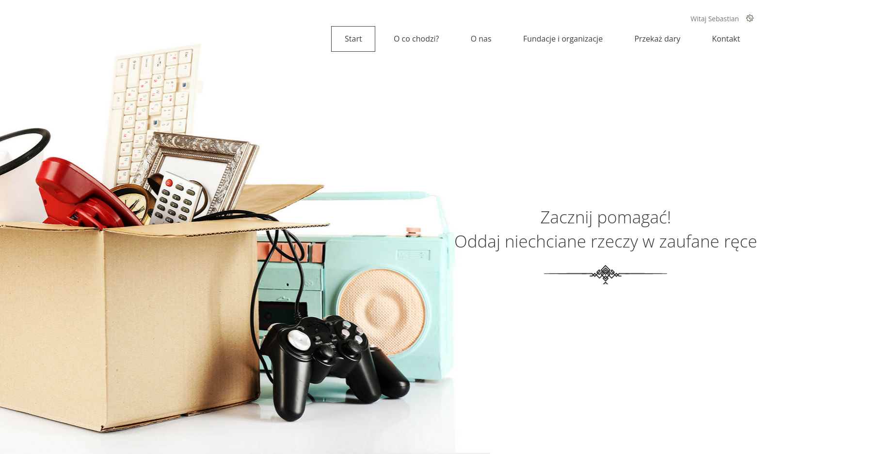
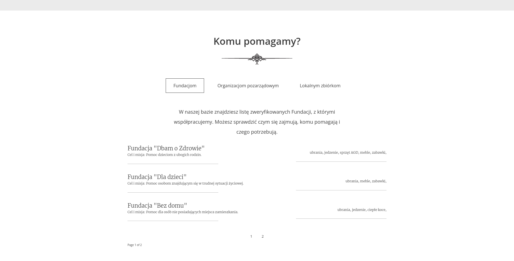
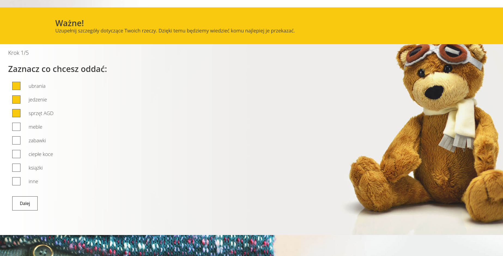

# Oddam-w-dobre-rece
> The aim of the project was to create a place where everyone could give away unwanted items to trusted institutions.
> Live demo [_here_](https://www.example.com). <!-- If you have the project hosted somewhere, include the link here. -->

## Table of Contents
* [General Info](#general-information)
* [Technologies Used](#technologies-used)
* [Features](#features)
* [Screenshots](#screenshots)
* [Setup](#setup)
* [Project Status](#project-status)
* [Room for Improvement](#room-for-improvement)
* [Acknowledgements](#acknowledgements)
* [Contact](#contact)
<!-- * [License](#license) -->

## General Information
  ### What problem does the project solve?
- The user has things in their home that they want to get rid of, but don't know how.
- There are many solutions available, but many of them require extra effort or are not trusted.
- Verified places have to be travelled to and there is no time/no way to go there, and the containers under the house or local collections are unverified and you don't know if these things will actually get to those in need.

<!-- You don't have to answer all the questions - just the ones relevant to your project. -->

## Technologies Used
- Python - version 3.10.6
- Django - version 3.2
- JavaScript - ECMAScript 2021
- jQuery - version 3.4.1
- PostgreSQL - version 14.5

## Features
- Django administrator profile 
    - management (CRUD) of administrators and trusted institutions 
    - overview of donations made
- User profile 
  - registration
  - login
  - adding donations
  - viewing submitted gifts
- Five-step donation form supported by JavaScript
- Counter of donations made and organisations supported
- Possibility of archiving donations

## Screenshots

<!-- If you have screenshots you'd like to share, include them here. -->

## Setup
Requirements/dependencies are listed in a requirements.txt file which is located in the project's main directory.

<!--
## Usage
How does one go about using it?
Provide various use cases and code examples here.

`write-your-code-here`
-->

## Project Status
Project is: _in progress_ 
There are still a few things in the project that need improvement. 
There are several functionalities that I want to implement to improve and facilitate the user experience of the application.

## Room for Improvement
Room for improvement:
- home page - pagination of the institutions
- appropriate filtering of institutions in the form

To do:
- Confirmation/activation of account
- Handling forgotten passwords
- Handling the contact form

## Acknowledgements
- This project was based on design prototype prepared by one of Coders Lab UX course graduate.
- Many thanks to all my course colleagues!

## Contact
Created by [@skkaz7](https://www.linkedin.com/in/sebastian-kazmierczak) - feel free to contact me!

<!-- Optional -->
<!-- ## License -->
<!-- This project is open source and available under the [... License](). -->

<!-- You don't have to include all sections - just the one's relevant to your project -->
